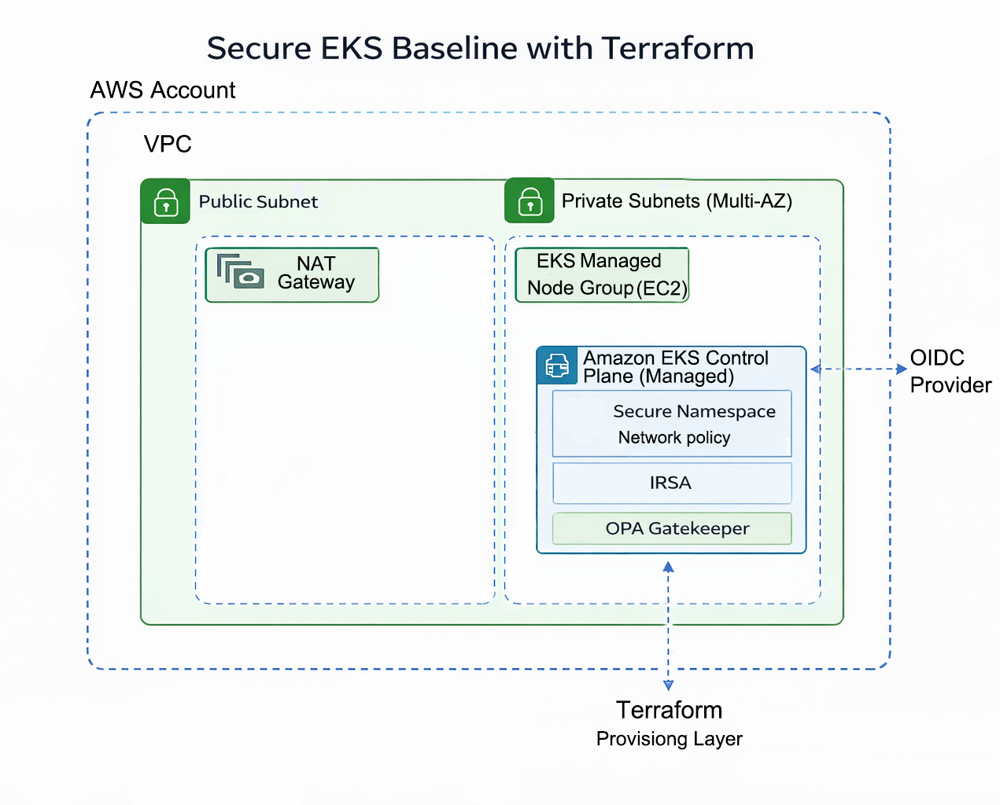

# AWS EKS Secure Baseline (Terraform)

Production-oriented Terraform implementation of a secure Amazon EKS baseline architecture.

This project provisions a hardened Kubernetes control plane and worker environment inside a multi-AZ VPC, applying security best practices across networking, identity, and policy enforcement layers.

It is designed to demonstrate practical EKS security architecture — not a lab walkthrough.

---

## Architecture Design



The baseline provisions:

- **AWS Account boundary**
- **VPC with public and private subnets (Multi-AZ)**
- **NAT Gateway in public subnet**
- **Private EKS worker nodes (Managed Node Group)**
- **Amazon EKS Control Plane (Managed)**
- **OIDC Provider for IRSA**
- **OPA Gatekeeper for policy enforcement**
- **Terraform as the provisioning layer**

High-level security principles applied:

- Private worker nodes only (no public exposure)
- IAM Roles for Service Accounts (IRSA)
- Namespace-level isolation
- Network policies
- Policy-as-Code enforcement
- Infrastructure fully managed via Terraform

---

## Security Controls Implemented

### 1. Network Isolation

- Public subnet used only for NAT Gateway.
- Worker nodes deployed exclusively in private subnets.
- Multi-AZ private subnet design.
- No direct public workload exposure.

### 2. EKS Control Plane (Managed)

- AWS-managed control plane.
- Kubernetes RBAC enforced at cluster level.
- Namespace-level workload separation.

### 3. IAM Roles for Service Accounts (IRSA)

- OIDC provider configured for the cluster.
- Pod-level IAM role binding.
- Eliminates node-level over-permissioning.
- Enables least-privilege access to AWS services.

### 4. Policy Enforcement with OPA Gatekeeper

- Gatekeeper deployed in-cluster.
- Constraint templates and constraints defined via Terraform.
- Example enforcement: required resource limits.
- Prevents non-compliant workloads at admission time.

### 5. Infrastructure as Code

- All infrastructure provisioned using Terraform.
- Modular structure for reproducibility.
- Remote state supported (S3 + DynamoDB locking recommended).
- Declarative, version-controlled security posture.

---

## Repository Structure

```
terraform/
├── main.tf
├── variables.tf
├── outputs.tf
└── modules/
└── security/
```

- Core infrastructure defined in root.
- Security-specific components modularized.
- Kubernetes manifests managed via `kubernetes_manifest` resources.

---

## What This Project Demonstrates

This repository reflects production-relevant concerns for Kubernetes platforms:

- Secure VPC segmentation
- Private EKS worker architecture
- Identity federation via OIDC
- IRSA implementation
- Admission control with Gatekeeper
- Policy-driven workload enforcement
- Clean infrastructure layering

It intentionally avoids unnecessary complexity (Ingress, ALB, service mesh) to keep focus on the baseline security model.

---

## Target Audience

Cloud Engineer  
Platform Engineer  
DevOps Engineer  
Junior SRE  

Particularly relevant for teams operating Kubernetes in AWS environments and seeking security-first cluster baselines.

---

## Future Improvements

- Private API endpoint configuration
- Cluster logging integration (CloudWatch)
- Managed add-ons configuration via Terraform
- Security group hardening
- Pod Security Standards enforcement profiles
- Multi-environment (dev/stage/prod) structure

---

## Author

Sebastian Silva C. – Cloud Engineer | Secure Infrastructure & Automation – Berlin, Germany
